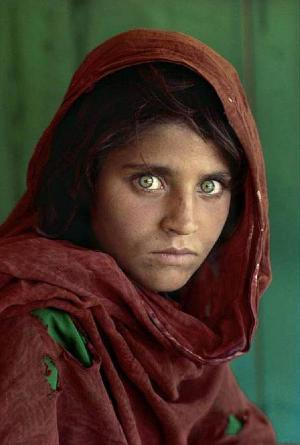

# Pablo piccaso sucks

Pablo picasso sucks, es un programa que recrea imagenes usando poligonos, la pocicion tamano y color de los poligonos va cambiando mediante un algoritmo genetico, el nombre viene de que el programa crea cuadros terribles como picasso

## Imagenes

 

## Uso

```bash
$ python piccaso.py --help

usage: picasso.py [-h] -f FILE -p POPULATION [-o OUTPUT_FOLDER] [-w WIDTH]

optional arguments:
  -h, --help            show this help message and exit
  -f FILE, --file FILE
  -p POPULATION, --population POPULATION
  -o OUTPUT_FOLDER, --output_folder OUTPUT_FOLDER
  -w WIDTH, --width WIDTH
```

## Tiempo estimado

Por cada fotografia se puede llegar a tomar 2 o 3 horas para que llegue a un resultado aceptable, despues de ese tiempo los cambios en la imagen de salida son casi insignificantes
