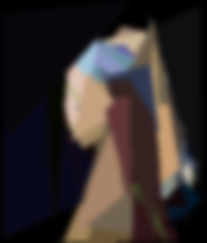

# Pablo piccaso sucks

Pablo picasso sucks, es un programa que recrea imagenes usando poligonos, la pocicion tamano y color de los poligonos va cambiando mediante un algoritmo genetico, el nombre viene de que el programa crea cuadros terribles como picasso

## Imagenes

 
 

## Uso

Para usar solamente se necesita python 2 y algunas librerias
```bash
python run.py <ruta de la foto>
```

## Usage

```python
import foobar

foobar.pluralize('word') # returns 'words'
foobar.pluralize('goose') # returns 'geese'
foobar.singularize('phenomena') # returns 'phenomenon'
```

## Contributing
Pull requests are welcome. For major changes, please open an issue first to discuss what you would like to change.

Please make sure to update tests as appropriate.

## License
[MIT](https://choosealicense.com/licenses/mit/)
