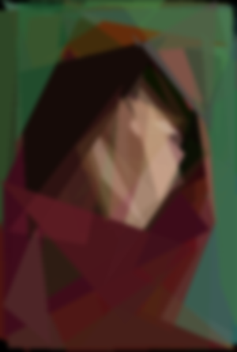

# Pablo piccaso 

Pablo picasso sucks, es un programa que recrea imagenes usando poligonos, la pocicion tamano y color de los poligonos va cambiando mediante un algoritmo genetico, el nombre viene de que el programa crea cuadros terribles como picasso

## Imagenes

 

## Uso

``` bash
$ python piccaso.py --help

usage: picasso.py [-h] -f FILE -p POPULATION [-o OUTPUT_FOLDER] [-w WIDTH]

optional arguments:
  -h, --help            show this help message and exit
  -f FILE, --file FILE
  -p POPULATION, --population POPULATION
  -o OUTPUT_FOLDER, --output_folder OUTPUT_FOLDER
  -w WIDTH, --width WIDTH
```

## Tiempo estimado

Por cada fotografia se puede llegar a tomar 2 o 3 horas para que llegue a un resultado aceptable, despues de ese tiempo los cambios en la imagen de salida son casi insignificantes

## Fitness fuction

La fitness fuction es vastante simple, para evaluar que tan parecida es la imagen creada comparada con la original se evalua el pixel ```x``` e ```y``` de cada imagen y se resta cada banda ```RGB``` y se eleva al cuadrado, ya que este valor puede llegar a ser muy grande a el valor de las sumas en cuadratura se le saca la raiz para que el valor sea mas bajo.

``` python
def fitness_fuction( self, create_img, original_img ):
    for y in (range(size[1])):
        for x in (range(size[0])):
            R,G,B    = create_img.getpixel((x,y))
            R_,G_,B_ = original_img.getpixel((x,y)
            self.fittness += math.sqrt((R - R_)**2 + (G-G_)**2 + (B-B_)**2)
```

## Pasardo los genes 

Para pasar lo genes de generacione en generacion se utilizaron varias tecnicas como crear un nuevo ADN inspirado en el automata con mejor ```fitness```, pasar lo genenes mediante probabilidad siendo el con mejor ```fitness``` con mas posiblidad de reproducirse, etc. Al final la que se implemento fue pasar el mejor automata crear una nueva generacion basado en sus genes exactos y mutarlos dejando solo uno sin cambios por si la generacion no mejora.

La mutacion del ADN simplemente es que se elige un poligono aleatorio y se edita tus vertices con valores aleatorios o se cambia el color del poligono (```RGBA```).

```python
def mutate(self, size):
    if rd.random() <= self.mutate_ratio:
        self.color = (rd.randrange(0,256),rd.randrange(0,256),rd.randrange(0,256),rd.randrange(0,256))
    else:
        index = rd.randrange(0, len(self.vectors))
        self.vectors[index] = (rd.randrange(0, size[0]),rd.randrange(0, size[1]))
```

